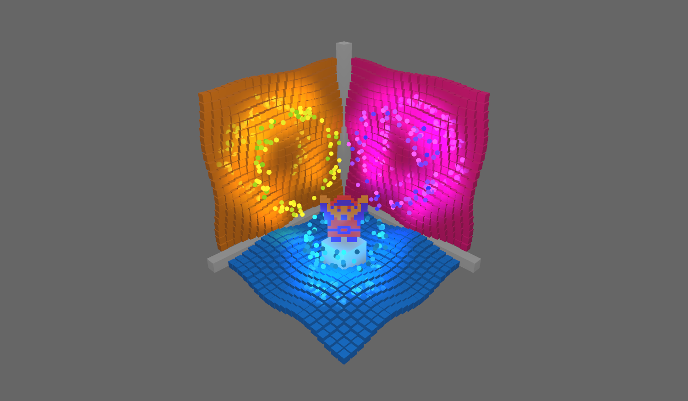

# Cubism Demo

A Bevy Engine port and refresh of an old C++ OpenGL lighting and shading demo I made back in 2010.

## To Run

To compile and run, use [cargo](https://www.rust-lang.org/learn/get-started):

```
cargo run --release
```

## Screenshot



## TODO

- [x] Get basic layout of all objects and camera.
- [x] Add grid material caching using xpm palettes?
- [x] Ensure that cube groups are parented? How to animate?
- [x] Add different animations via systems and enum component.
- [x] Add spinning light animation.
- [x] Add different camera angles.
- [x] Add onscreen instructions UI.
- [x] Add PBR spherical area lights.
- [x] Fix the UI instructions.
- [x] Add ron support and move configs out of code.
- [ ] Modularize XPM code to support loading different types and multi-character pixels.
- [ ] Restore 256 light setup once Bevy supports it.
- [ ] Nicer UI?

## Original Video

[](https://vimeo.com/15442169)

<p><a href="https://vimeo.com/15442169">Cubism Demo (ver. 2)</a> from <a href="https://vimeo.com/user2176585">Josh 015</a> on <a href="https://vimeo.com">Vimeo</a>.</p>
