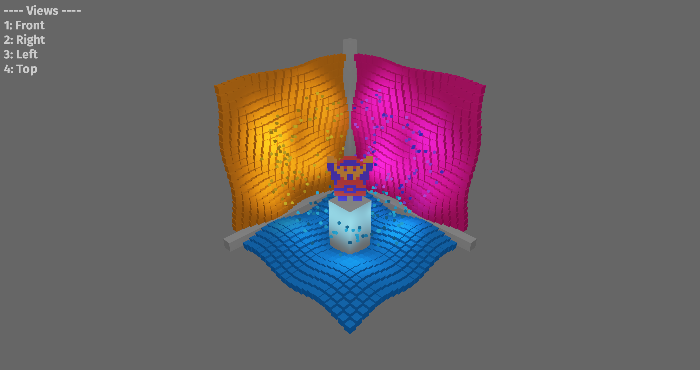

# Cubism Demo
A Bevy Engine port and refresh of an old C++ OpenGL lighting and shading demo I made back in 2010.

## To Run

To compile and run, use [cargo](https://www.rust-lang.org/learn/get-started):

```
cargo run --release
```

## Screenshots



## TODO
- [x] Get basic layout of all objects and camera.
- [x] Add grid material caching using xpm palettes?
- [x] Ensure that cube groups are parented? How to animate?
- [x] Add different animations via systems and enum component.
- [x] Add spinning light animation.
- [x] Add different camera angles.
- [x] Add onscreen instructions UI.
- [x] Add custom material with support for 256 lights.
- [x] Add simple tonemapping.
- [ ] Switch to enhanced lighting equation.
  - [ ] Add PBR spherical area lights.
  - [ ] Replace ambient light with RSRM light.
  - [ ] Make pillars smooth & metallic.
  - [ ] Make grids smoth & translucent, and then put light rings behind them.
  - [ ] Make sprite extremely rough.
  - [ ] Restore green light ring around sprite.
- [ ] Add simple clustered forward renderer.
- [ ] Nicer UI?

## Original Video
[](https://vimeo.com/15442169)
<p><a href="https://vimeo.com/15442169">Cubism Demo (ver. 2)</a> from <a href="https://vimeo.com/user2176585">Josh 015</a> on <a href="https://vimeo.com">Vimeo</a>.</p>
